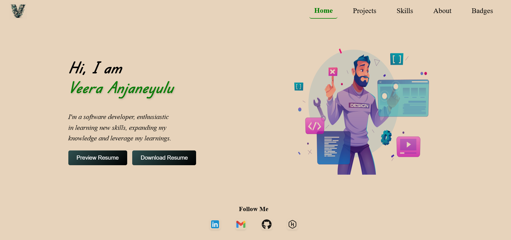

# Veera Anjaneyulu's Portfolio

A modern, responsive personal portfolio website built with **React**, **Vite**, and **Supabase**. This full-stack application showcases projects, skills, education history, and provides access to a downloadable resume, all backed by a Supabase database.

## Features

- **Single Page Application** with React Router
- **Responsive Design** for desktop and mobile
- **Project Gallery** with images and links to code
- **Skills Section** with icons
- **About Me** timeline with education history
- **Resume Preview** (modal) and download
- **External Badges** (Credly)
- **Footer** with social/contact links

## Demo



## Getting Started

### Prerequisites

- [Node.js](https://nodejs.org/) (v16 or higher recommended)
- [npm](https://www.npmjs.com/) (comes with Node.js)

### Installation

1. **Clone the repository:**
   ```sh
   git clone https://github.com/veera-0/React-Portfolio.git
   cd React-Portfolio
   ```

2. **Install dependencies:**
   ```sh
   npm install
   ```

3. **Start the development server:**
   ```sh
   npm run dev
   ```
   The app will be available at [http://localhost:5173](http://localhost:5173) (or as indicated in your terminal).

### Building for Production

```sh
npm run build
```
The production-ready files will be in the `dist` directory.

### Preview Production Build

```sh
npm run preview
```

## Project Structure

```
.
├── public/
│   └── resume/
│       ├── pdf.worker.js
│       └── VelpuriAnjaneyulu.pdf
├── src/
│   ├── assets/
│   │   ├── images/
│   │   └── resume/
│   ├── components/
│   │   ├── footer/
│   │   ├── header/
│   │   ├── main/
│   │   │   ├── About/
│   │   │   └── skills/
│   │   └── pages/
│   ├── App.jsx
│   ├── App.css
│   ├── main.jsx
│   └── index.css
├── index.html
├── package.json
└── vite.config.js
```

### Key Files

- [`src/App.jsx`](src/App.jsx): Main app component, sets up routing.
- [`src/components/header/Headers.jsx`](src/components/header/Headers.jsx): Navigation bar and sidebar.
- [`src/components/main/Main.jsx`](src/components/main/Main.jsx): Hero section with resume preview/download.
- [`src/components/main/skills/Skills.jsx`](src/components/main/skills/Skills.jsx): Skills grid.
- [`src/components/main/About/About.jsx`](src/components/main/About/About.jsx): About me and education timeline.
- [`src/components/pages/Project.jsx`](src/components/pages/Project.jsx): Project gallery.
- [`src/components/pages/Badges.jsx`](src/components/pages/Badges.jsx): Redirects to Credly badges.
- [`src/components/footer/Footer.jsx`](src/components/footer/Footer.jsx): Social/contact links.

## Customization

- **Projects:** Edit [`src/components/pages/Project.jsx`](src/components/pages/Project.jsx) and [`src/components/main/ProjectMain.jsx`](src/components/main/ProjectMain.jsx).
- **Skills:** Edit [`src/components/main/skills/Skills.jsx`](src/components/main/skills/Skills.jsx).
- **About/Education:** Edit [`src/components/main/About/About.jsx`](src/components/main/About/About.jsx).
- **Resume:** Replace `src/assets/resume/Velpuri Anjaneyulu.pdf` and `src/assets/resume/resume_pic.png` with your own files.
- **Social Links:** Update URLs in [`src/components/footer/Footer.jsx`](src/components/footer/Footer.jsx).

## Dependencies

### Frontend
- [React](https://react.dev/) - UI framework
- [Vite](https://vitejs.dev/) - Build tool and dev server
- [react-router-dom](https://reactrouter.com/) - Client-side routing
- [react-icons](https://react-icons.github.io/react-icons/) - Icons library
- [react-modal](https://github.com/reactjs/react-modal) - Modal dialogs
- [react-vertical-timeline-component](https://github.com/stephane-monnot/react-vertical-timeline) - Timeline UI

### Backend & Database
- [Supabase](https://supabase.com/) - Backend as a Service
  - Real-time database
  - Authentication (if implemented)
  - File storage for images

### PDF Handling (Optional)
- [@react-pdf-viewer/core](https://react-pdf-viewer.dev/)
- [@react-pdf/renderer](https://react-pdf.org/)
- [react-pdf](https://github.com/wojtekmaj/react-pdf)

## Linting

Run ESLint to check code quality:
```sh
npm run lint
```

## Environment Setup

1. Create a `.env.local` file in the project root:
   ```env
   VITE_SUPABASE_URL=your-supabase-project-url
   VITE_SUPABASE_ANON_KEY=your-supabase-anon-key
   ```

2. Set up your Supabase tables:
   - `profileDB`: User profile information
   - `projectData`: Project details
   - `educationData`: Education history

## Deployment

The project can be deployed to any static hosting service (e.g., Netlify, Vercel, GitHub Pages).

### Environment Variables
When deploying, make sure to set these environment variables in your hosting platform:
- `VITE_SUPABASE_URL`
- `VITE_SUPABASE_ANON_KEY`

### Build Configuration
- The `vite.config.js` is configured to include PDF assets
- Supabase environment variables are handled via Vite's env handling


**Author:** Veera Venkata Anjaneyulu Velpuri

For any questions, feel free to reach out via [LinkedIn](https://www.linkedin.com/in/anjaneyulu-velpuri/)